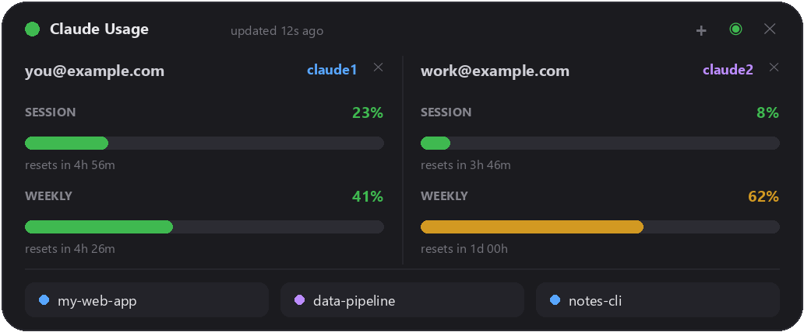
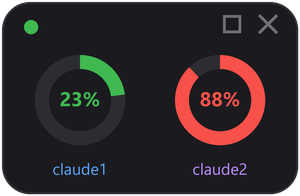

# Claude Usage Widget

A tiny always-on-top desktop widget for Windows that shows, in real time, how
much of each Claude account's limits you've used — so you can pace your
**session (5-hour)** and **weekly (7-day)** usage and switch between accounts
before you hit a wall.



For every configured account it shows:

- **SESSION** — 5-hour limit usage + time until reset
- **WEEKLY** — 7-day limit usage + time until reset
- the account e-mail and the CLI label (e.g. `claude`, `claude1`) it maps to

The row of buttons at the bottom lists your **most-recent projects** across all
accounts. Click one to open a new terminal in that folder and launch the
matching Claude CLI right there.

## Compact mode

Click **－** in the title bar to collapse the widget into a tiny panel showing
just a **session-usage ring per account** — one ring for each configured
account, filled to its current 5-hour utilization and colour-coded the same way
as the full bars (green → yellow → red), with the account's accent colour
labelling it underneath.



Hover a ring for the full session **and** weekly breakdown, then click **□** (or
double-click a ring) to expand back to the full view. The widget remembers which
mode it was in across restarts.

> **Privacy:** everything runs locally. The widget talks only to Anthropic's
> own API (the same endpoints Claude Code uses) with your existing local login.
> No e-mails, tokens, or usage data are sent anywhere else, and nothing personal
> is stored in this repository — your `config.json` is created locally on first
> run and is git-ignored.

---

## Requirements

- Windows
- **Python 3.11+** (only the standard library — `tkinter` + `urllib`, no `pip install` needed)
- [Claude Code](https://claude.com/claude-code) installed and logged in at least once

## Install & run

```powershell
git clone https://github.com/PanLipton/claude-usage-widget.git
cd claude-usage-widget
```

Then double-click **`Start Widget.vbs`** (launches with no console window).

Alternatives:

- **`Start Widget.bat`**, or
- directly: `pythonw claude_usage_widget.pyw`

On first run the widget copies `config.example.json` → `config.json` (a single
account pointing at the default `%USERPROFILE%\.claude`). Edit that file, or use
the **➕** button in the widget, to add your own accounts.

## Window controls

- **Drag** — grab anywhere on the panel and move it.
- **➕** — add an account (opens a small inline form).
- **－ / □** — collapse to the [compact ring view](#compact-mode) / restore the
  full layout.
- **◉** — pin on top. Green = always-on-top (default), grey = off.
- **✕** — close. The window position is remembered in `widget_state.json`.
- **✕ next to an account** — remove that account (appears only when you have
  more than one; never removes your last account). This only edits the widget's
  config — your actual Claude login is untouched.

Hover an e-mail / CLI label to see which config directory the account uses and
how to re-authorize it. The coloured dot next to each project shows which
account it belongs to; **right-click a project** to open it with a different
account.

---

## Configuration — `config.json`

```json
{
  "poll_seconds": 180,
  "accounts": [
    { "label": "claude",  "config_dir": "%USERPROFILE%\\.claude" },
    { "label": "claude1", "config_dir": "%USERPROFILE%\\.claude-account1" },
    { "label": "claude2", "config_dir": "%USERPROFILE%\\.claude-account2" }
  ]
}
```

| Key | Meaning |
|---|---|
| `poll_seconds` | How often to poll the usage API (minimum 15s). The reset countdowns tick every second locally regardless. |
| `accounts[].label` | The name shown on the column **and** the CLI command used to open projects (see below). For one account, `claude` is fine. |
| `accounts[].config_dir` | The Claude config directory for that account. Supports environment variables like `%USERPROFILE%`. |

You can add or remove accounts with the **➕ / ✕** buttons in the widget (which
write this file for you), or edit it by hand. The window resizes itself to fit.

> Don't have time to learn the internals? Open this folder in **Claude Code**
> and ask it: *"set me up with two Claude accounts and configure this widget for
> both."* The next section is exactly what it (or you) needs to do.

---

## Running several Claude accounts on one computer

Claude Code decides which login to use from the **`CLAUDE_CONFIG_DIR`**
environment variable (it defaults to `%USERPROFILE%\.claude`). To keep two or
more separate logins side by side, you give each one its own config directory
and a tiny wrapper command that points `CLAUDE_CONFIG_DIR` at it.

### 1. Create a launcher per account

Make a folder for small scripts and put it on your `PATH` — e.g.
`%USERPROFILE%\.local\bin`:

```powershell
$bin = "$env:USERPROFILE\.local\bin"
New-Item -ItemType Directory -Force $bin | Out-Null

# claude1 -> %USERPROFILE%\.claude-account1
@"
@echo off
set "CLAUDE_CONFIG_DIR=%USERPROFILE%\.claude-account1"
claude %*
"@ | Set-Content -Encoding ascii "$bin\claude1.bat"

# claude2 -> %USERPROFILE%\.claude-account2
@"
@echo off
set "CLAUDE_CONFIG_DIR=%USERPROFILE%\.claude-account2"
claude %*
"@ | Set-Content -Encoding ascii "$bin\claude2.bat"
```

Add the folder to your `PATH` once (new terminals will pick it up):

```powershell
setx PATH "$env:PATH;$env:USERPROFILE\.local\bin"
```

> The widget opens projects by running `<label>.bat` from
> `%USERPROFILE%\.local\bin`, so the launcher name must match the account
> `label` in `config.json` (`claude1` → `claude1.bat`). If no matching `.bat`
> exists it falls back to running the bare command (`claude`).

### 2. Log in to each account

Open a **new** terminal so the updated `PATH` is active, then:

```powershell
claude1      # then type /login  and sign in with your first account
claude2      # then type /login  and sign in with your second account
```

Each `/login` writes credentials into that account's own config directory
(`.claude-account1`, `.claude-account2`, …), so the two never collide.

### 3. Point the widget at them

Add an account in the widget with the **➕** button (or edit `config.json`):
set **Label** to `claude1` and **Config dir** to
`%USERPROFILE%\.claude-account1`, and likewise for `claude2`. The columns appear
immediately.

### Re-authorizing later

If an account shows `no credentials` or an auth error, just run its command
(`claude1`) in a terminal and `/login` again — or click any project button for
that account, which opens a terminal running its CLI.

---

## How it works

Data comes from the same OAuth endpoints Claude Code itself uses:

| Purpose | Request |
|---|---|
| Limit usage | `GET https://api.anthropic.com/api/oauth/usage` |
| Account e-mail | `GET https://api.anthropic.com/api/oauth/profile` |
| Token refresh | `POST https://console.anthropic.com/v1/oauth/token` |

Access tokens are read from each account's `<config_dir>\.credentials.json`.
When a token is about to expire (they live ~8h) the widget refreshes it and
**writes it back** to the same file, so Claude Code and the widget stay in sync.

> ⚠️ The token endpoint sits behind Cloudflare and rejects requests without a
> `User-Agent` header, so the widget sends a `claude-cli/...` UA. The usage
> endpoint is rate-limited per account, so polling defaults to 180s with
> per-account exponential backoff.

## Autostart with Windows (optional)

Press `Win+R`, type `shell:startup`, and drop a shortcut to **`Start Widget.vbs`**
into that folder.

## License

[MIT](LICENSE).

---
---

# Claude Usage Widget — Українською

Мінімалістичний desktop-віджет для Windows, що в реальному часі показує
використання лімітів ваших Claude-акаунтів — щоб рівномірно витрачати
**сесійний (5-годинний)** і **тижневий (7-денний)** ліміти й вчасно перемикатися
між акаунтами.

Для кожного акаунта:

- **SESSION** — використання 5-годинного ліміту + час до ресету
- **WEEKLY** — використання 7-денного ліміту + час до ресету
- e-mail акаунта та мітка CLI (`claude`, `claude1`, …)

Кнопки знизу — **останні проєкти** по всіх акаунтах: клік відкриває новий
термінал у теці проєкту й запускає відповідний Claude CLI.

## Компактний режим

Кнопка **－** у заголовку згортає віджет у маленьку панель, де лишаються тільки
**кільця сесійного навантаження** — по одному кільцю на кожен акаунт. Кільце
заповнюється відповідно до поточного 5-годинного ліміту й має той самий колір,
що й повні смуги (зелений → жовтий → червоний), а під ним — акцентний колір
акаунта.


Наведіть на кільце, щоб побачити повну сесійну **й** тижневу інформацію, а тоді
натисніть **□** (або подвійний клік по кільцю), щоб розгорнути назад. Віджет
запам'ятовує обраний режим між запусками.

> **Приватність:** усе працює локально. Віджет звертається лише до API Anthropic
> (ті самі ендпоінти, що й Claude Code) із вашим локальним логіном. Жодні дані
> нікуди більше не передаються; у репозиторії немає особистих даних — ваш
> `config.json` створюється локально під час першого запуску і не потрапляє в git.

## Вимоги

- Windows, **Python 3.11+** (лише стандартна бібліотека — нічого встановлювати)
- Встановлений Claude Code, у який ви хоча б раз увійшли

## Запуск

Подвійний клік на **`Start Widget.vbs`** (без вікна консолі). Альтернативи —
`Start Widget.bat` або `pythonw claude_usage_widget.pyw`. Під час першого запуску
`config.example.json` копіюється у `config.json` (один акаунт на
`%USERPROFILE%\.claude`).

## Керування вікном

- **Перетягування** — затисніть будь-де на панелі.
- **➕** — додати акаунт (невелика форма прямо у віджеті).
- **－ / □** — згорнути у [компактний режим з кільцями](#компактний-режим) /
  розгорнути назад.
- **◉** — закріпити поверх вікон (зелений = увімкнено, сірий = вимкнено).
- **✕** — закрити (позиція запам'ятовується).
- **✕ біля акаунта** — прибрати акаунт (з'являється лише коли акаунтів більше
  одного; останній не видаляється). Це міняє лише конфіг віджета — ваш логін
  Claude не чіпається.

Наведіть на e-mail чи мітку — побачите, який каталог використовує акаунт і як
переавторизуватись. Якщо акаунт **лише один**, підказка над проєктами не
показується (нема між чим обирати). Правий клік на проєкті — відкрити іншим
акаунтом.

## Налаштування — `config.json`

```json
{
  "poll_seconds": 180,
  "accounts": [
    { "label": "claude", "config_dir": "%USERPROFILE%\\.claude" }
  ]
}
```

- `poll_seconds` — період опитування API (мінімум 15с); лічильники до ресету
  оновлюються щосекунди локально.
- `label` — назва колонки **і** CLI-команда для відкриття проєктів.
- `config_dir` — каталог конфігурації акаунта (підтримує `%USERPROFILE%`).

Додавати/видаляти акаунти можна кнопками **➕ / ✕** у віджеті або вручну.

> Не хочете розбиратись? Відкрийте цю теку в **Claude Code** і попросіть:
> *«налаштуй мені два Claude-акаунти і цей віджет для обох»*. Нижче — саме те, що
> для цього потрібно.

## Кілька Claude-акаунтів на одному комп'ютері

Claude Code обирає логін за змінною середовища **`CLAUDE_CONFIG_DIR`** (типово
`%USERPROFILE%\.claude`). Щоб мати кілька окремих логінів, кожному дають свій
каталог і маленький скрипт-обгортку, що задає `CLAUDE_CONFIG_DIR`.

**1. Створіть лаунчер на кожен акаунт** у теці, що є в `PATH` (напр.
`%USERPROFILE%\.local\bin`):

```powershell
$bin = "$env:USERPROFILE\.local\bin"
New-Item -ItemType Directory -Force $bin | Out-Null

@"
@echo off
set "CLAUDE_CONFIG_DIR=%USERPROFILE%\.claude-account1"
claude %*
"@ | Set-Content -Encoding ascii "$bin\claude1.bat"

@"
@echo off
set "CLAUDE_CONFIG_DIR=%USERPROFILE%\.claude-account2"
claude %*
"@ | Set-Content -Encoding ascii "$bin\claude2.bat"

setx PATH "$env:PATH;$env:USERPROFILE\.local\bin"
```

> Віджет відкриває проєкти, запускаючи `<label>.bat` з
> `%USERPROFILE%\.local\bin`, тож ім'я лаунчера має збігатися з `label` у
> `config.json` (`claude1` → `claude1.bat`).

**2. Увійдіть у кожен акаунт** (у новому терміналі, щоб підхопився `PATH`):

```powershell
claude1      # далі /login — вхід першим акаунтом
claude2      # далі /login — вхід другим акаунтом
```

**3. Додайте акаунти у віджет** кнопкою **➕**: `claude1` →
`%USERPROFILE%\.claude-account1`, `claude2` → `%USERPROFILE%\.claude-account2`.

**Переавторизація:** якщо акаунт показує `no credentials` — запустіть його
команду (`claude1`) і знову `/login`, або клацніть будь-який його проєкт.

## Як це працює

Дані беруться з тих самих OAuth-ендпоінтів, що використовує Claude Code
(`/api/oauth/usage`, `/api/oauth/profile`, `/v1/oauth/token`). Токени читаються з
`<config_dir>\.credentials.json` і автоматично оновлюються та **записуються
назад**, тож Claude Code і віджет лишаються синхронізованими.

## Автозапуск із Windows

`Win+R` → `shell:startup` → покладіть туди ярлик на **`Start Widget.vbs`**.

## Ліцензія

[MIT](LICENSE).
